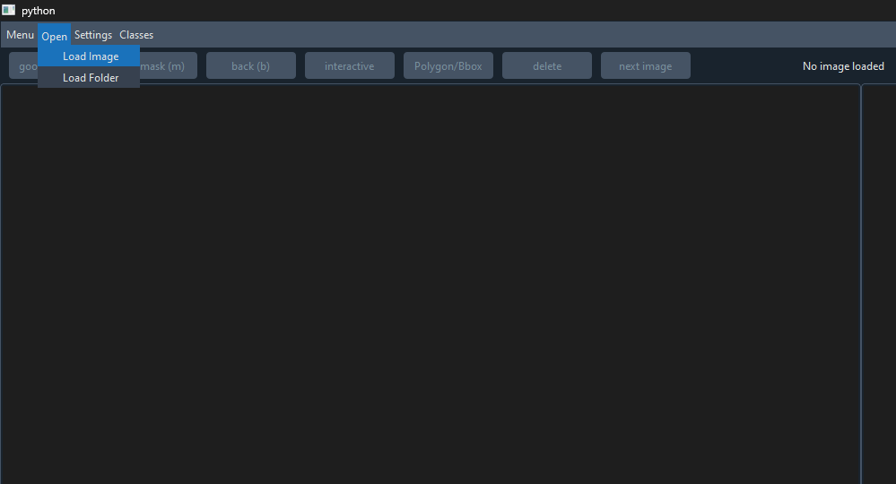
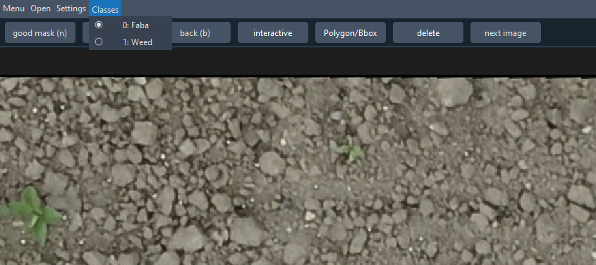
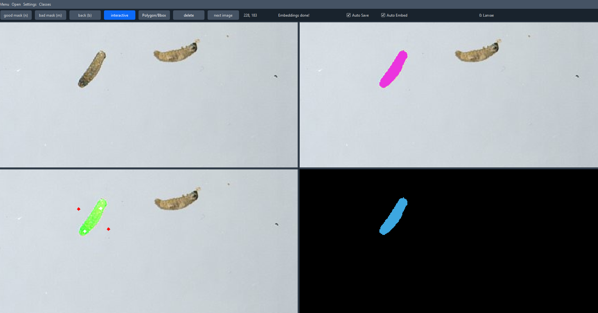
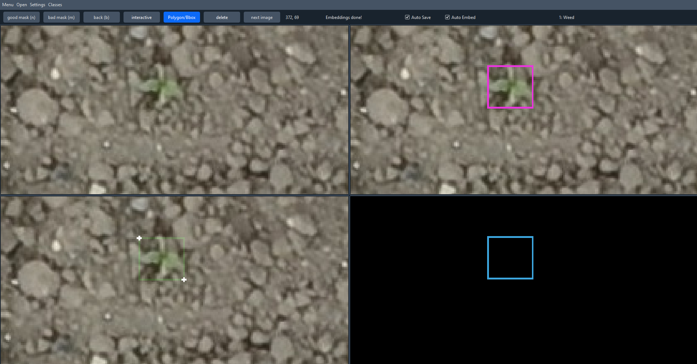
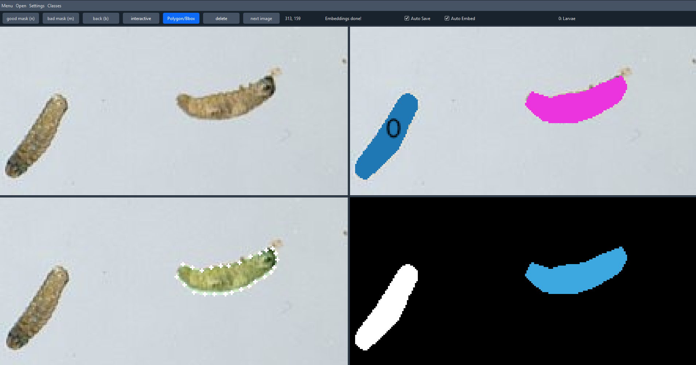
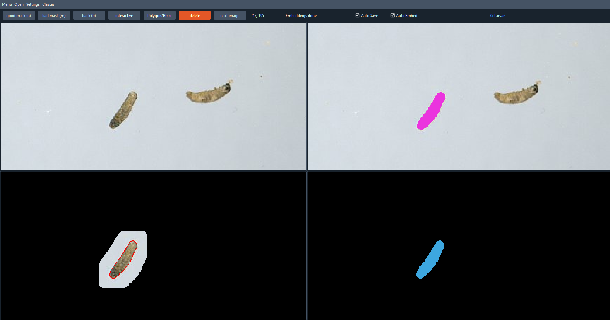

## Step 1: Loading images / folders
Click the "Open" button in the top-left corner and choose "Load Folder" to load a folder of images, or "Load Image" to load a single image.

After specifying your input data location you will be asked to choose an output folder where annotations should be saved. If you plan to close the application and continue annotating later, select the same output folder so ARAMSAM can track progress.

## Step 2: Select object class
If you have defined multiple classes in `aramsam_annotator/configs.py`, select the class you want to annotate from the dropdown menu next to the "Settings" button. The selected class will be used for all annotations you store until you select a different class.

## Step 3: Start annotating interactively with SAM
Click the "interactive" button to start prompt-based annotation with SAM. Hover your mouse over any of the four visualization panes to see mask suggestions from SAM. You can zoom the visualizations with the mouse wheel. To pan the image, hold the left mouse button and drag.

To refine the suggested masks, add positive prompt points (white) by pressing `a` or by right-clicking. Add negative prompt points (red) by pressing `s`. To undo the last prompt point, press `d`. Once you are satisfied with a mask, press `n` to store it. To undo the last stored mask, press `b` or click the "back" button.

Note: Stored annotations are not written to disk until you click "next image" while "Auto Save" is checked, or until you click "Save" under "Menu" in the top-left corner. The format of the saved annotations is defined in `aramsam_annotator/configs.py`.

## Step 4: Manual annotation tools
If you cannot get a satisfactory mask from SAM, you can draw masks manually by defining polygon points. If you're working on an object-detection task, you can also draw bounding boxes. To enable manual annotation tools, click the "polygon/bbox" button.

### Bounding boxes
To draw a bounding box, right-click once to set the top-left corner and once to set the bottom-right corner. To undo the last drawn bounding box, press `b` or click the "back" button. Press `n` to store the drawn bounding box.

### Polygon masks
To draw a polygon mask, right-click to define polygon points. After defining more than two points, the software automatically switches from bbox mode to polygon mode. Press `n` to close and store the polygon. To undo the last drawn polygon, press `b` or click the "back" button. Press `d` to undo the last polygon point.

## Step 5: Checking the collection of annotated objects
Typically in the top-right visualization pane, you can review the collection of all annotated objects for the current image. If you notice mistakes, activate delete mode by clicking the "delete" button. In delete mode, right-click any annotated object in the collection to remove it. To exit delete mode, click the "delete" button again.

Once you are satisfied with your annotations, click "next image" to save them and continue to the next image or tile. To save without continuing to the next image, click "Menu" in the top-left corner and then "Save". If "Auto Save" is checked, annotations will be saved automatically when you click "next image". To close the application, click the "X" in the top-right corner but make sure your progress was saved beforehand.

NOTE: If you are running ARAMSAM on a CPU-only system, image embedding by SAM may take a while. By default, embedding starts as soon as an image is loaded. If you want ARAMSAM to start embedding only on demand, uncheck the "Auto Embed" checkbox. To reenable embedding and to enable using interative mode just check the box again. Embedding is not required for the manual annotation tools.